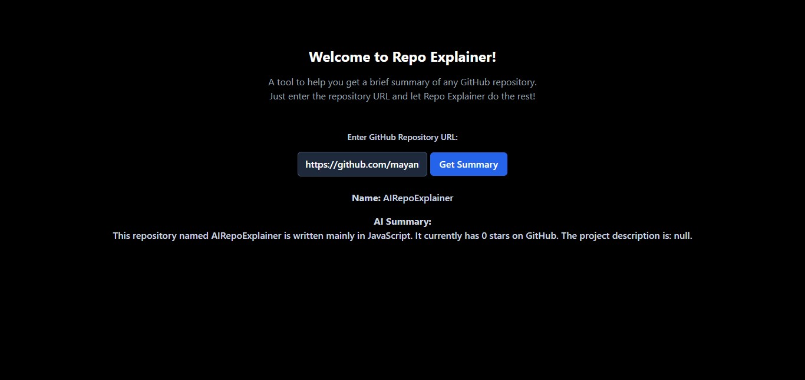

# 🚀 AI Repo Explainer

AI Repo Explainer is a simple full-stack application that fetches GitHub repository data and generates a readable summary using API integrations and AI.

The goal of this project was to gain practical experience with:

- API integration
- Backend → External API communication
- SDK usage
- Frontend ↔ Backend data flow

---

## 🧠 How It Works

1. User enters a GitHub repository URL.
2. Backend extracts repository details using the GitHub REST API.
3. Repository data is processed on the server.
4. AI SDK generates a simple explanation of the repository.
5. The summary is displayed on the frontend.

---

## 🛠️ Tech Stack

**Frontend**
- HTML
- TailwindCSS
- JavaScript

**Backend**
- Node.js
- Express.js

**APIs & SDKs**
- GitHub REST API
- OpenAI SDK

---

## 📦 Features

- Fetch GitHub repository information
- API-based backend architecture
- AI-generated repository summaries
- Clean and simple UI
- Error handling for invalid repositories

---

## ⚙️ Setup Instructions

Clone the repository:

```bash
git clone https://github.com/mayankhikhi/AIRepoExplainer
```

Install dependencies:
```bash
npm install
```

Start the server:
```bash
node server.js
```

Open in brownser
```arduino
http://localhost:3000
```

---

## Screenshots



---
This project was build to understand real-world API integrations and SDK-based workflows commonely used in modern web applications and startup environments.
